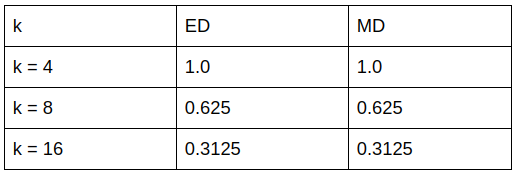

## Integrantes
- Indhira Ramirez
- Reynaldo Rojas

## Librerías usadas
- pandas
- numpy
- face_recognition
- rtree
- sklearn
- heapq
# Algoritmos de búsqueda
## distacia euclidiana y manhattan
~~~
DE_l2 = lambda x,y : sum((x-y)**2)**0.5
DM_l1 = lambda x,y : sum(abs(x-y))
~~~
La distancia euclidiana, es la raíz cuadrada de la suma de los cuadrados de las diferencias en n-dimensiones. Mientras que la manhattan mide la distancia como la suma de el valor absoluto las diferencias de las coordenadas. 

## KnnSearch con heap
~~~
def knnSearchHeap(data, Q, k):
    result = []
    for index, row in data.iterrows():
      d = DE_l2(Q, row)   
      heapq.heappush(result, (-d, index))
    while len(result) > k:
      heapq.heappop(result)    
    result = [ heapq.heappop(result) for _ in range(len(result))]
    result = list(reversed(result))
    return result
~~~
Se tiene data como todas las tuplas, Q como el vector característico de la foto que buscamos y k como el número máximo de resultados que buscaremos.
La búsqueda knn con heap itera por toda la data y agrega esta a un max heap ordenado por -d, negativa de la distancia, respecto a el vector característico Q. Se usa -d ya que lo que buscamos son los vectores caracteristicos con mayor similitud y por ende con menor distancia, al ser un max heap nos conviene agregarlo con -d. Después de agregar todos los datos al heap, quitamos los elementos con menor cercanía, o mayor distancia, hasta quedarnos con un heap de tamaño k. Por último, revertimos el orden de la lista para que los primeros en esta sean los mas cercanos al vector característico Q.

## rtree
~~~
p = index.Property()
p.dimension = 32
p.buffering_capacity = 5
p.dat_extension = 'data'
p.idx_extension = 'index'
idx = index.Index(properties=p)

pca = PCA(n_components=32);
~~~
El índice rtree no es eficiente con datos de muchas dimensiones. Antes de insertar los encodings de las imágenes, se utilizó la técnica de PCA de la librería sklearn. Esto con la finalidad de reducir las dimensiones de 128 a 32.
~~~
pca_data = pca.fit_transform(data);
k = 16
q = pca_data[5];
print("target", encodings.iloc[5,129]);
np.delete(pca_data, 0, 0);

for i in range(len(pca_data)):
  x = pca_data[i];
  idx.insert(i, (*x, *x));
~~~

# Experimentación
## Precisión con distancias euclidiana y manhattan

En nuestra data no hubo mucha diferencia al usar ambas distancias.
## Tiempos de Knn-RTree vs Knn-Secuencial
| Tiempo  | KNN-RTree | KNN-Secuencial |
| ------- | --------- | -------------- |
| N = 100 |  4.580E-4 |     3.458E-2    |
| N = 200 | 6.659E-4   |    6.710E-2  |
| N = 400 | 1.255E-3  |  2.025E-1  |
| N = 800 | 1.755E-3  |   2.464E-1   |
| N = 1600 |  3.301E-3  |    4.451E-1    |
| N = 3200 |  6.473E-3  |   8.823E-1    |
| N = 6400 |  1.186E-1 |  1.622  |